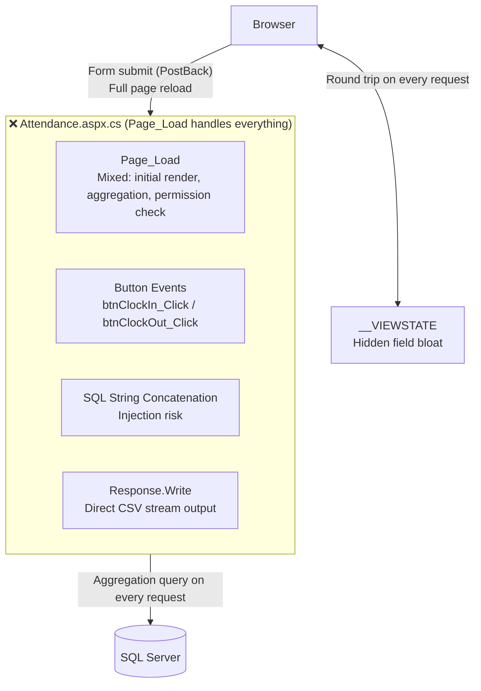
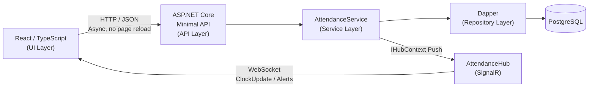
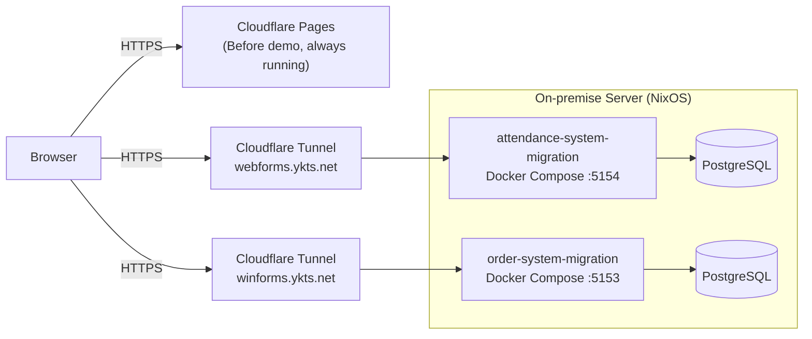

[🇯🇵 日本語](README.md) | [🇬🇧 English](README.en.md)

# .NET WebForms Migration (Attendance Management System)

[](https://github.com/yktsnet/attendance-system-migration/actions/workflows/ci.yml)
[](https://github.com/yktsnet/attendance-system-migration/actions/workflows/deploy.yml)

A sample project for practicing the step-by-step migration of a legacy WebForms business application to `.NET 8 Web API + React`.

Sister repo of [order-system-migration](https://github.com/yktsnet/order-system-migration) (WinForms migration). In addition to deconstructing and restructuring WebForms-specific problems (AutoPostBack, ViewState, Page_Load concentration), it also covers **adding real-time features that were structurally impossible with WebForms**.

---

## Quick Start

### Prerequisites
- [Docker Desktop](https://www.docker.com/products/docker-desktop/)
- .NET SDK 8.0 (for local development)
- Node.js 20+ (for local development)

### Full Setup (Docker only)

```bash
cp .env.example .env
docker compose up -d --build
```

- Frontend + API: http://localhost:5154
- Swagger UI: http://localhost:5154/api-docs

### Local Development (with HMR)

```bash
# 1. Start DB only
docker compose up db -d

# 2. Backend (separate terminal)
cd src/Api && dotnet run

# 3. Frontend (separate terminal)
cd src/Web && npm ci && npm run dev
```

- API: http://localhost:5154
- Frontend (Vite HMR): http://localhost:5173

---

## 1. Overview and Goals

The WebForms app works. Pages render, data is saved, and CSV is exported. The problem is not functionality — it's structure. AutoPostBack, ViewState, and concentrated logic in Page_Load increase maintenance costs, make testing difficult, and make it hard to identify the scope of impact with each change.

The goal of this project is to make these structural problems visible and to demonstrate through design the rationale that can justify migration.

**Before Demo:** https://attendance-system-migration-legacy.pages.dev  
**After Demo (WebForms):** https://webforms.ykts.net  
**After API Documentation (Swagger UI):** `/api-docs`

### Key Practices

- **Decode**: Identify WebForms-specific problems — AutoPostBack, ViewState, concentrated Page_Load logic
- **Separate**: Separate responsibilities into UI, Service, and Repository layers
- **Rebuild**: Reconstruct with .NET 8 Web API and React
- **Quality**: Ensure testability and introduce unit tests
- **Extend**: Add WebSocket real-time features to the foundation after structural separation is complete

---

## 2. Before: The Reality of Legacy Tight Coupling

`legacy/AttendanceWebForms/` reproduces the typical legacy WebForms state where "Page_Load knows everything."

```
+-----------------------------------------------------------+
| [ Attendance Screen ]                                     |
+-----------------------------------------------------------+
| Employee No: [ EMP-001 ]  Dept: [ Engineering ▼ ]        |
|                            ↑ AutoPostBack=true            |
|                              Full page reload on selection|
| -------------------------------------------------------   |
| [ Clock In ]  [ Clock Out ]  [ Break Start ]  [ Break End ]|
|  ↑ Button click triggers PostBack → Records with raw SQL  |
| -------------------------------------------------------   |
| This month attendance: 12 days   Total hours: 96h         |
| ↑ DB aggregation query runs on every Page_Load            |
| -------------------------------------------------------   |
| [ Export Monthly Report ]                                 |
|  ↑ CSV streamed directly via Response.Write               |
+-----------------------------------------------------------+
```

### Key Issues

- **UX degradation from AutoPostBack**: The entire page reloads every time a department is selected, resetting the scroll position.
- **ViewState bloat**: Storing attendance history and aggregation data in ViewState causes request size to balloon.
- **Concentrated processing in Page_Load**: Initial rendering, aggregation, and permission checks are all mixed in `Page_Load`, making testing impossible.
- **CSV output via Response.Write**: Prone to encoding issues, with no control when errors occur.
- **SQL injection risk**: SQL built by string concatenation.



> **About the Before Demo**  
> A static HTML (`index.html`) lets you experience AutoPostBack white flash, PostBack delays, ViewState hidden fields, and garbled CSV downloads.  
> `Attendance.aspx` / `Attendance.aspx.cs` contain actual WebForms code (with comments), serving as a reference for reading code-level problems without needing a runtime environment.

---

## 3. After Phase 1 — Transition to Modern Architecture

After migration, components are fully separated by responsibility, and PostBack is eliminated.

- **Eliminate AutoPostBack**: Replace department selection with async fetch, removing page reloads.
- **Eliminate ViewState**: Stop server-side state management; fetch necessary data from the API as needed.
- **Decompose Page_Load**: Separate mixed processing into `AttendanceService` by responsibility, enabling unit testing.
- **Normalize CSV output**: Replace with UTF-8 download via `Content-Disposition` header.



### Separation of Calculation Logic (Testability)

`AttendanceCalculator` is extracted from `AttendanceService` so that calculation logic can be tested independently without a DB connection.

- **Break deduction**: Default 60 minutes, adjustable by the administrator in ±minutes. When actual break is longer or shorter than the prescribed amount, reporting the difference rather than the time is more practical.
- **Rounding**: Configurable rounding unit per employee. Absorbs small deviations in clock-in/out times to produce more realistic aggregations.
- **Overtime premium**: Automatically calculates legal overtime × 1.25. Eliminates manual work in monthly payroll processing.

```
AttendanceService (DB access)
    └── AttendanceCalculator (pure calculation) ← directly tested by xUnit
```

### Implemented Endpoints

| Method | Path | Description | Auth |
|---|---|---|---|
| POST | `/auth/login` | Administrator login (JWT issuance) | — |
| GET | `/employees` | Employee master list | — |
| POST | `/employees` | Employee registration | ✓ |
| PUT | `/employees/{id}` | Update employee info (hourly rate, rounding unit) | ✓ |
| DELETE | `/employees/{id}` | Delete employee | ✓ |
| POST | `/attendances/clock-in` | Clock in | — |
| POST | `/attendances/clock-out` | Clock out | — |
| PUT | `/attendances/{id}` | Correct attendance record (including break adjustment) | ✓ |
| GET | `/attendances/current` | List of currently clocked-in employees | — |
| GET | `/attendances/{employeeId}/monthly` | Monthly attendance summary | — |
| GET | `/attendances/{employeeId}/history` | Attendance history | — |
| GET | `/attendances/{employeeId}/monthly/csv` | Monthly CSV (UTF-8 BOM) | — |
| GET | `/attendances/{employeeId}/payroll` | Monthly payroll calculation results | — |
| POST | `/demo/reset` | Demo attendance reset (backfill) | — |

---

## 4. After Phase 2 — Beyond the Structural Limits of WebForms

WebForms is structurally incapable of pushing from server to client. Phase 2 starts from this constraint and implements real-time operational monitoring.

### Before / After Comparison

| Before (WebForms) | After (.NET 8 + React) |
|---|---|
| Page reload required to check attendance status | Instant updates via SignalR WebSocket |
| Missed clock-outs discovered on next day's spreadsheet | Automatically detected same day → Push to administrator |
| Overtime violations first discovered in end-of-month aggregation | Real-time warning when approaching threshold |
| Correction time determined by individual inquiry | Average clock-out time automatically set as default value |

### Added Features

| Feature | Implementation | Description |
|---|---|---|
| Real-time attendance board | SignalR (`AttendanceHub`) | Push to all clients on every clock event. See who is working now without reloading. |
| Overtime alert | SignalR + threshold check | When monthly overtime reaches the threshold on clock-out, push to administrator group. |
| Missed clock-out alert | `IHostedService` + SignalR | The most frequent attendance issue is forgotten clock-outs. Check every 30 minutes; push to administrator if employee hasn't clocked out past average clock-out time +1h. Eliminates after-the-fact self-reporting. |
| Average clock-out profile | `IHostedService` (daily) | Save the average clock-out time from the last 30 days to `employee_profiles`. Automatically generates the baseline for missed clock-out detection and the default value for correction forms from personal records. |

---

## 5. Tech Stack

| Layer | Technology | Reason |
|---|---|---|
| **Frontend** | React, TypeScript, Vite, Tailwind CSS | Compose attendance UX and admin dashboard in a single SPA. Achieve both type safety and fast builds |
| **Backend** | .NET 8 (Minimal API), SignalR, xUnit | Inherit the C# assets from the migrated WebForms and reconstruct as a lightweight API. Push features via SignalR, calculation logic guaranteed by xUnit |
| **Database** | PostgreSQL (Dapper) | Handle attendance aggregation with lightweight access close to SQL, without relying on full ORM features |
| **Infrastructure** | Docker Compose, Cloudflare Tunnel, GitHub Actions, NixOS (on-premise) | Eliminate IIS/Windows dependency and start with the same procedure everywhere. Build CI/CD and continuous publishing solo |

---

## 6. Design Decisions

The reasoning behind technology choices is in §5 Tech Stack; the implementation intent of each feature is noted alongside in §3 and §4. This section covers only cross-cutting design decisions (from the decision log `JUDGE.md`).

- **Not adopting Strangler Fig for incremental migration**: The textbook approach is to replace incrementally using the strangler fig pattern, but at this scale, the cost of tracking parallel paths degrades visibility. We decided to perform structural separation in one go.
- **"Administrator doesn't need to think" as the design axis**: Break ±minute input, per-employee rounding, automatic overtime premium calculation, and preemptive missed clock-out detection are all designed to reduce administrator judgment and manual work (see §3 and §4 for individual implementations).

---

## 7. Modernization Policy

For deconstruction of WebForms-specific problems (AutoPostBack, ViewState, Page_Load concentration), see §3. This section covers policies other than structural separation itself.

1. **Environment abstraction (Docker)**: Eliminate IIS / Windows Server dependency; configure for same-procedure startup anywhere.
2. **CI/CD pipelining (GitHub Actions)**: Automatically run build and tests on every push. Integration tests also complete in CI with PostgreSQL service containers.
3. **Extensibility after structural separation**: In a structure with separated responsibilities, Push-type features that were impossible to implement in WebForms can be added later. SignalR integration is proof of this.

> **Focus & Scope**  
> This project specializes in **"deconstruction of WebForms-specific problems and structural separation."**  
> Full authentication/authorization implementation and production DB redundancy configuration are **Out-of-Scope**.

---

## 8. Demo Operations

### Before Demo
`legacy/AttendanceWebForms/index.html` is hosted on Cloudflare Pages. Fixed URL, always running.

### After Demo

**After Demo (WebForms):** https://webforms.ykts.net

[order-system-migration](https://github.com/yktsnet/order-system-migration) (WinForms After) and this repo (WebForms After) each have independent Cloudflare Tunnels, and **both are always running**.



### Deployment Steps (Initial)

**1. Server Requirements**

- Docker (`docker compose` available)
- Cloudflare Tunnel (`cloudflared`)

```bash
cloudflared tunnel create webforms-migration
cloudflared tunnel route dns webforms-migration webforms.ykts.net
```

**2. Deploy**

Pushing to the main branch triggers GitHub Actions for automatic deployment (rsync via Tailscale + `docker compose up --build`).
Required GitHub Secrets (deployment host, SSH key, Tailscale OAuth, etc.) are managed in repository operations documentation (not listed in README).

For manual deployment:

```bash
cp .env.example .env
./infrastructure/deploy.sh
```

---

## 9. Comparison with order-system-migration

| | [order-system-migration](https://github.com/yktsnet/order-system-migration) | attendance-system-migration (this repo) |
|---|---|---|
| **Before** | WinForms (desktop) | WebForms (legacy web) |
| **Nature of problems** | Problems that surface at runtime | Structural debt that accumulates while running |
| **Legacy-specific problems** | UI freeze, LPT1 dependency | AutoPostBack, ViewState |
| **Business domain** | Order management | Attendance management |
| **Phase 2 extension** | AI natural language interface | SignalR real-time features |
| **Common problems** | Tight coupling in code-behind, SQL injection, untestable ||

---

## 10. Directory Structure

```
.
├── .github/
│   └── workflows/
│       ├── ci.yml                        # CI (.NET tests + React build)
│       └── deploy.yml                    # Deploy (rsync via Tailscale + docker compose up)
├── infrastructure/
│   ├── db/
│   │   ├── init/
│   │   │   └── 01_schema.sql             # DB initialization (table definitions + seed)
│   │   └── seed/
│   │       ├── generate_seed.py          # Dummy data generation script
│   │       └── 02_seed.sql               # Pre-generated sample data
│   ├── deploy.sh                         # .env transfer + docker compose up --build
│   └── setup.sh                          # Server initial setup (Docker check, directory creation)
├── legacy/
│   └── AttendanceWebForms/               # Before (unchanged)
│       ├── index.html                    # Working demo (Cloudflare Pages)
│       ├── style.css
│       ├── report.csv                    # Garbled CSV sample (Shift-JIS)
│       ├── Attendance.aspx               # WebForms markup (reference)
│       └── Attendance.aspx.cs            # Code-behind (reference only, no runtime needed)
├── src/
│   ├── Api/                              # After: .NET 8 Minimal API
│   │   ├── Endpoints/
│   │   │   ├── AttendanceEndpoints.cs
│   │   │   ├── AuthEndpoints.cs
│   │   │   └── EmployeeEndpoints.cs
│   │   ├── Hubs/
│   │   │   └── AttendanceHub.cs          # SignalR hub
│   │   ├── Services/
│   │   │   ├── AttendanceService.cs
│   │   │   ├── AttendanceCalculator.cs   # Isolated calculation logic (no DB, test target)
│   │   │   ├── EmployeeService.cs
│   │   │   ├── DailyProfileUpdateService.cs  # Daily batch (avg_clockout update)
│   │   │   └── LateStayCheckService.cs       # 30-minute missed clock-out check
│   │   ├── Program.cs
│   │   └── Dockerfile                    # Multi-stage (React + .NET build)
│   ├── Api.Tests/                        # xUnit tests
│   │   ├── AttendanceCalculatorTests.cs  # Pure calculation tests (no DB required)
│   │   └── ClockInTests.cs              # Clock-in integration tests (PostgreSQL required)
│   └── Web/                             # After: React Frontend
│       └── src/
│           ├── components/
│           │   ├── ClockPanel.tsx
│           │   ├── MonthlySummary.tsx
│           │   ├── AttendanceHistory.tsx
│           │   ├── AttendanceCorrectionModal.tsx
│           │   ├── Dashboard.tsx        # Real-time board + alerts
│           │   ├── AdminPanel.tsx
│           │   └── EmployeeManager.tsx
│           ├── App.tsx
│           ├── api.ts
│           └── types.ts
├── .env.example
├── docker-compose.yml
└── README.md
```
