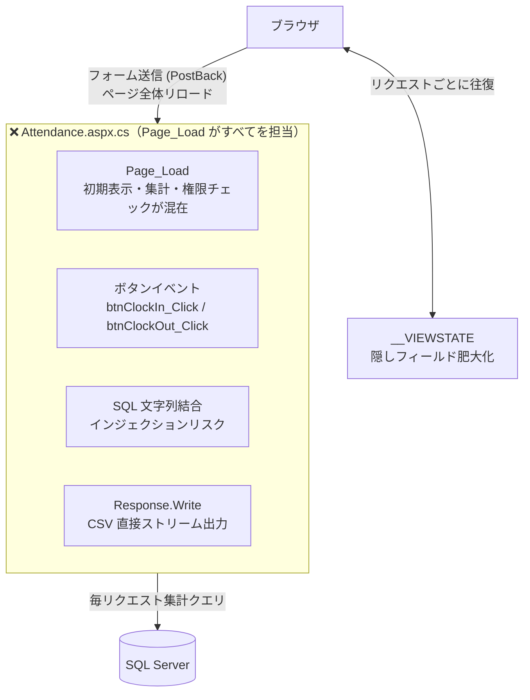
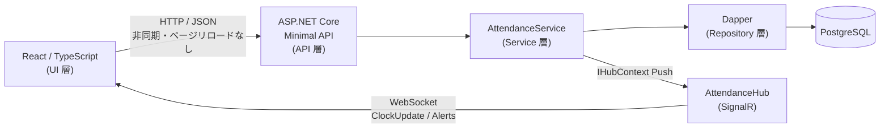
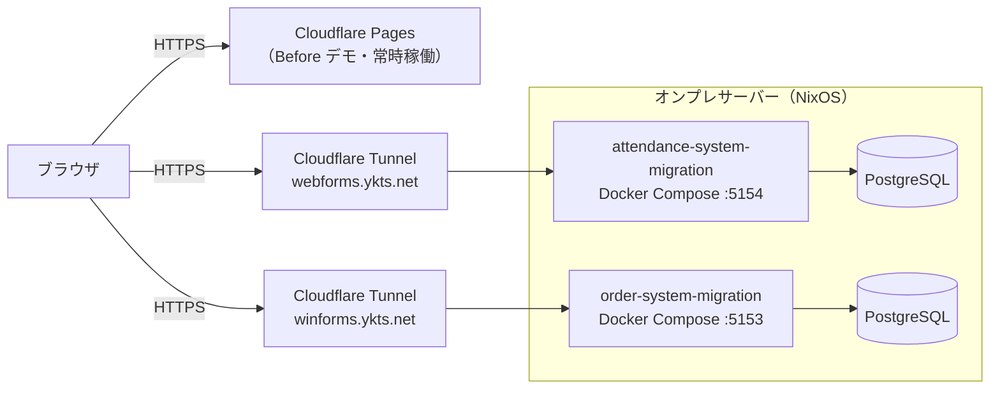

# .NET WebForms Migration (Attendance Management System)

[](https://github.com/yktsnet/attendance-system-migration/actions/workflows/ci.yml)
[](https://github.com/yktsnet/attendance-system-migration/actions/workflows/deploy.yml)

レガシーな WebForms 業務アプリを題材に、`.NET 8 Web API + React` への段階的移行を実践するサンプルプロジェクト。

[order-system-migration](https://github.com/yktsnet/order-system-migration)（WinForms 移行）の姉妹リポ。WebForms 固有の問題（AutoPostBack・ViewState・Page_Load 集中）の解体と再構成に加え、**WebForms では構造的に実現不可能だったリアルタイム機能**の追加まで扱う。

---

## Quick Start

### Prerequisites
- [Docker Desktop](https://www.docker.com/products/docker-desktop/)
- .NET SDK 8.0（ローカル開発時）
- Node.js 20+（ローカル開発時）

### Full Setup (Docker only)

```bash
cp .env.example .env
docker compose up -d --build
```

- Frontend + API: http://localhost:5154
- Swagger UI: http://localhost:5154/api-docs

### Local Development (with HMR)

```bash
# 1. DB のみ起動
docker compose up db -d

# 2. バックエンド（別ターミナル）
cd src/Api && dotnet run

# 3. フロントエンド（別ターミナル）
cd src/Web && npm ci && npm run dev
```

- API: http://localhost:5154
- Frontend (Vite HMR): http://localhost:5173

---

## 1. Overview and Goals

WebForms アプリは機能する。ページは表示され、データは保存され、CSV も出力される。問題は動作ではなく構造にある。AutoPostBack・ViewState・Page_Load への処理集中は、保守コストを高め、テストを困難にし、改修のたびに影響範囲の特定を難しくする。

本プロジェクトの目的は、こうした構造的問題を可視化し、移行を正当化できる根拠を設計で示すことにある。

**Before Demo:** https://attendance-system-migration-legacy.pages.dev  
**After Demo (WebForms):** https://webforms.ykts.net  
**After API ドキュメント (Swagger UI):** `/api-docs`

### Key Practices

- **解読**: AutoPostBack・ViewState・Page_Load 集中という WebForms 固有の問題の特定
- **分離**: UI、Service、Repository 層への責務分離
- **刷新**: .NET 8 Web API と React による再構築
- **品質**: テスタビリティの確保と単体テストの導入
- **拡張**: 構造分離が完了した基盤への WebSocket リアルタイム機能の追加

---

## 2. Before: The Reality of Legacy Tight Coupling

`legacy/AttendanceWebForms/` では、WebForms 時代の典型的な「Page_Load がすべてを知りすぎている」状態を再現している。

```
+-----------------------------------------------------------+
| [ 勤怠打刻画面 ]                                          |
+-----------------------------------------------------------+
| 社員番号: [ EMP-001 ]  部署: [ 開発部 ▼ ]               |
|                         ↑ AutoPostBack=true               |
|                           選ぶたびにページ全体がリロード  |
| -------------------------------------------------------   |
| [ 出勤 ]  [ 退勤 ]  [ 休憩開始 ]  [ 休憩終了 ]           |
|  ↑ ボタンクリックでポストバック → SQL直書きで記録         |
| -------------------------------------------------------   |
| 今月の出勤日数: 12日   合計時間: 96時間                   |
| ↑ Page_Load のたびにDB集計クエリが走る                    |
| -------------------------------------------------------   |
| [ 月次レポート出力 ]                                      |
|  ↑ Response.Write でCSVを直接ストリーム出力               |
+-----------------------------------------------------------+
```

### Key Issues

- **AutoPostBack による UX 劣化**: 部署選択のたびにページ全体がリロードされ、スクロール位置がリセットされる。
- **ViewState の肥大化**: 打刻履歴・集計データを ViewState に保持することでリクエストサイズが膨張する。
- **Page_Load への処理集中**: 初期表示・集計・権限チェックがすべて `Page_Load` に混在し、テスト不能。
- **Response.Write による CSV 出力**: 文字化けが発生しやすく、エラー時の制御が不能。
- **SQL インジェクションのリスク**: 文字列結合による SQL 組み立て。



> **Before デモについて**  
> 静的 HTML（`index.html`）で AutoPostBack の白フラッシュ・PostBack 遅延・ViewState 隠しフィールド・文字化け CSV ダウンロードを体感できる。  
> `Attendance.aspx` / `Attendance.aspx.cs` には実際の WebForms コード（コメント付き）を収録。実行環境は不要で、コードレベルの問題を読み取るためのリファレンスとして機能する。

---

## 3. After Phase 1 — Transition to Modern Architecture

移行後は責務に応じてコンポーネントを完全に分離し、PostBack を廃止する。

- **AutoPostBack の廃止**: 部署選択を非同期フェッチに置き換え、ページリロードを排除。
- **ViewState の廃止**: サーバー側の状態管理をやめ、必要なデータは都度 API から取得。
- **Page_Load の解体**: 混在していた処理を `AttendanceService` へ責務分離し、単体テストを可能にする。
- **CSV 出力の正規化**: `Content-Disposition` ヘッダーによる UTF-8 ダウンロードに置き換え。



### Separation of Calculation Logic (Testability)

`AttendanceCalculator` を `AttendanceService` から独立させ、DB 接続なしで計算ロジック単体をテスト可能にしている。

- **休憩控除**: デフォルト 60 分、管理者が ±分で調整。実際の休憩が規定より長かった・短かった場合、時刻ではなく差分で申告する方が実務に即している。
- **端数処理**: 社員ごとの丸め単位を設定。数分の出退勤のブレを吸収し、実態に近い集計にする。
- **残業割増**: 法定超過 × 1.25 を自動計算。月次給与処理の手動作業を排除。

```
AttendanceService（DBアクセス）
    └── AttendanceCalculator（純粋計算）← xUnit が直接テスト
```

### Implemented Endpoints

| Method | Path | 説明 | 認証 |
|---|---|---|---|
| POST | `/auth/login` | 管理者ログイン（JWT 発行） | — |
| GET | `/employees` | 社員マスタ一覧 | — |
| POST | `/employees` | 社員登録 | ✓ |
| PUT | `/employees/{id}` | 社員情報更新（時給・丸め単位） | ✓ |
| DELETE | `/employees/{id}` | 社員削除 | ✓ |
| POST | `/attendances/clock-in` | 出勤打刻 | — |
| POST | `/attendances/clock-out` | 退勤打刻 | — |
| PUT | `/attendances/{id}` | 打刻修正（休憩調整含む） | ✓ |
| GET | `/attendances/current` | 現在出勤中の社員一覧 | — |
| GET | `/attendances/{employeeId}/monthly` | 月次勤怠サマリー | — |
| GET | `/attendances/{employeeId}/history` | 打刻履歴一覧 | — |
| GET | `/attendances/{employeeId}/monthly/csv` | 月次 CSV（UTF-8 BOM） | — |
| GET | `/attendances/{employeeId}/payroll` | 月次給与計算結果 | — |
| POST | `/demo/reset` | デモ用打刻リセット（バックフィル） | — |

---

## 4. After Phase 2 — Beyond the Structural Limits of WebForms

WebForms はサーバーからクライアントへの Push が構造的に不可能。Phase 2 はその制約を起点に、リアルタイム運用監視を実装する。

### Before / After Comparison

| Before (WebForms) | After (.NET 8 + React) |
|---|---|
| 出勤状況確認にページリロード必須 | SignalR WebSocket で即時反映 |
| 未退勤は翌日スプレッドシートで発覚 | 当日中に自動検知 → 管理者へ Push |
| 36 協定超過は月末集計で初めて判明 | 閾値接近時点でリアルタイム警告 |
| 打刻修正時刻は個別ヒアリング | 平均退勤時刻をデフォルト値として自動セット |

### Added Features

| 機能 | 実装 | 内容 |
|---|---|---|
| リアルタイム出勤ボード | SignalR (`AttendanceHub`) | 打刻のたびに全クライアントへ Push。誰が今働いているかをリロードなしで把握できる。 |
| 36 協定アラート | SignalR + 閾値チェック | 退勤打刻時に月次残業が閾値に達していたら管理者グループへ Push |
| 未退勤アラート | `IHostedService` + SignalR | 勤怠で最も頻発するのは退勤忘れ。30 分ごとに検査し、平均退勤時刻 +1h を超えて未退勤の社員を管理者へ Push。事後の自己申告を不要にする。 |
| 平均退勤プロファイル | `IHostedService`（日次） | 直近 30 日の退勤時刻平均を `employee_profiles` に保存。未退勤検知の基準値と修正フォームのデフォルト値を個人の実績から自動生成。 |

---

## 5. Tech Stack

| Layer | Technology | Reason |
|---|---|---|
| **Frontend** | React, TypeScript, Vite, Tailwind CSS | 打刻 UX と管理ダッシュボードを同一 SPA で構成。型安全と高速ビルドを両立 |
| **Backend** | .NET 8 (Minimal API), SignalR, xUnit | 移行元 WebForms の C# 資産を引き継ぎ軽量 API へ再構成。Push 機能は SignalR、計算ロジックは xUnit で担保 |
| **Database** | PostgreSQL (Dapper) | ORM フル機能に依存せず、SQL に近い軽量アクセスで勤怠集計を扱う |
| **Infrastructure** | Docker Compose, Cloudflare Tunnel, GitHub Actions, NixOS (オンプレ) | IIS/Windows 依存を排除し同一手順で起動。CI/CD・常時公開まで一人で構築 |

---

## 6. Design Decisions

技術選定の理由は §5 Tech Stack、各機能の実装意図は §3・§4 に併記している。本節では横断的な設計判断のみ記す（判断ログ `JUDGE.md` より）。

- **段階移行に Strangler Fig を採らない**: 教科書的には締め殺しパターンで段階置換するが、本規模では並走経路を追うコストが見通しを悪くする。構造分離を一度で行う方針とした。
- **「管理者が考えなくていい」を仕様の軸に**: 休憩の ±分入力・社員ごとの端数丸め・残業割増の自動計算・未退勤の事前検知は、いずれも管理者の判断と手作業を減らすための設計（個別の実装は §3・§4 を参照）。

---

## 7. Modernization Policy

WebForms 固有問題（AutoPostBack・ViewState・Page_Load 集中）の解体は §3 を参照。本節では構造分離そのもの以外の方針を記す。

1. **環境の抽象化 (Docker)**: IIS / Windows Server 依存を排除し、どこでも同一手順で起動できる構成へ。
2. **CI/CD のパイプライン化 (GitHub Actions)**: push ごとにビルド・テストを自動実行。PostgreSQL サービスコンテナで統合テストも CI 上で完結。
3. **構造分離後の拡張性**: 責務が分離された構造では、WebForms では実装不可能だった Push 型機能を後から追加できる。SignalR の統合がその実証。

> **Focus & Scope**  
> 本プロジェクトは **「WebForms 固有の問題の解体と構造分離」** に特化している。  
> 認証・認可の本格実装や本番用 DB の冗長化構成は **対象外 (Out-of-Scope)**。

---

## 8. Demo Operations

### Before Demo
`legacy/AttendanceWebForms/index.html` を Cloudflare Pages でホスト。URL 固定・常時稼働。

### After Demo

**After Demo (WebForms):** https://webforms.ykts.net

[order-system-migration](https://github.com/yktsnet/order-system-migration)（WinForms After）と本リポ（WebForms After）はそれぞれ独立した Cloudflare Tunnel を持ち、**両方常時稼働**する。



### Deployment Steps (Initial)

**1. サーバー要件**

- Docker（`docker compose` が使えること）
- Cloudflare Tunnel（`cloudflared`）

```bash
cloudflared tunnel create webforms-migration
cloudflared tunnel route dns webforms-migration webforms.ykts.net
```

**2. デプロイ**

main ブランチへの push で GitHub Actions が自動デプロイします（Tailscale 経由 rsync + `docker compose up --build`）。
必要な GitHub Secrets（デプロイ先ホスト・SSH 鍵・Tailscale OAuth 等）はリポジトリ運用ドキュメントで管理する（README には記載しない）。

手動デプロイが必要な場合:

```bash
cp .env.example .env
./infrastructure/deploy.sh
```

---

## 9. Comparison with order-system-migration

| | [order-system-migration](https://github.com/yktsnet/order-system-migration) | attendance-system-migration（本リポ） |
|---|---|---|
| **Before** | WinForms（デスクトップ） | WebForms（レガシー Web） |
| **問題の性質** | 実行時に表面化する問題 | 稼働しながら蓄積する構造的負債 |
| **レガシー固有の問題** | UI フリーズ・LPT1 依存 | AutoPostBack・ViewState |
| **業務ドメイン** | 受注管理 | 勤怠管理 |
| **Phase 2 の拡張** | AI 自然言語インターフェース | SignalR リアルタイム機能 |
| **共通の問題** | コードビハインド密結合・SQL インジェクション・テスト不能 ||

---

## 10. Directory Structure

```
.
├── .github/
│   └── workflows/
│       ├── ci.yml                        # CI（.NET テスト + React ビルド）
│       └── deploy.yml                    # Deploy（Tailscale 経由 rsync + docker compose up）
├── infrastructure/
│   ├── db/
│   │   ├── init/
│   │   │   └── 01_schema.sql             # DB 初期化（テーブル定義 + シード）
│   │   └── seed/
│   │       ├── generate_seed.py          # ダミーデータ生成スクリプト
│   │       └── 02_seed.sql               # 生成済みサンプルデータ
│   ├── deploy.sh                         # .env 転送・docker compose up --build
│   └── setup.sh                          # サーバー初回セットアップ（Docker 確認・ディレクトリ作成）
├── legacy/
│   └── AttendanceWebForms/               # Before（変更なし）
│       ├── index.html                    # 動作デモ（Cloudflare Pages）
│       ├── style.css
│       ├── report.csv                    # 文字化け CSV サンプル（Shift-JIS）
│       ├── Attendance.aspx               # WebForms マークアップ（参照用）
│       └── Attendance.aspx.cs            # コードビハインド（参照用・実行不要）
├── src/
│   ├── Api/                              # After: .NET 8 Minimal API
│   │   ├── Endpoints/
│   │   │   ├── AttendanceEndpoints.cs
│   │   │   ├── AuthEndpoints.cs
│   │   │   └── EmployeeEndpoints.cs
│   │   ├── Hubs/
│   │   │   └── AttendanceHub.cs          # SignalR ハブ
│   │   ├── Services/
│   │   │   ├── AttendanceService.cs
│   │   │   ├── AttendanceCalculator.cs   # 計算ロジック分離（DB 不要・テスト対象）
│   │   │   ├── EmployeeService.cs
│   │   │   ├── DailyProfileUpdateService.cs  # 日次バッチ（avg_clockout 更新）
│   │   │   └── LateStayCheckService.cs       # 30 分ごと未退勤チェック
│   │   ├── Program.cs
│   │   └── Dockerfile                    # マルチステージ（React + .NET ビルド）
│   ├── Api.Tests/                        # xUnit テスト
│   │   ├── AttendanceCalculatorTests.cs  # 純粋計算テスト（DB 不要）
│   │   └── ClockInTests.cs              # 打刻統合テスト（PostgreSQL 必要）
│   └── Web/                             # After: React Frontend
│       └── src/
│           ├── components/
│           │   ├── ClockPanel.tsx
│           │   ├── MonthlySummary.tsx
│           │   ├── AttendanceHistory.tsx
│           │   ├── AttendanceCorrectionModal.tsx
│           │   ├── Dashboard.tsx        # リアルタイムボード + アラート
│           │   ├── AdminPanel.tsx
│           │   └── EmployeeManager.tsx
│           ├── App.tsx
│           ├── api.ts
│           └── types.ts
├── .env.example
├── docker-compose.yml
└── README.md
```
